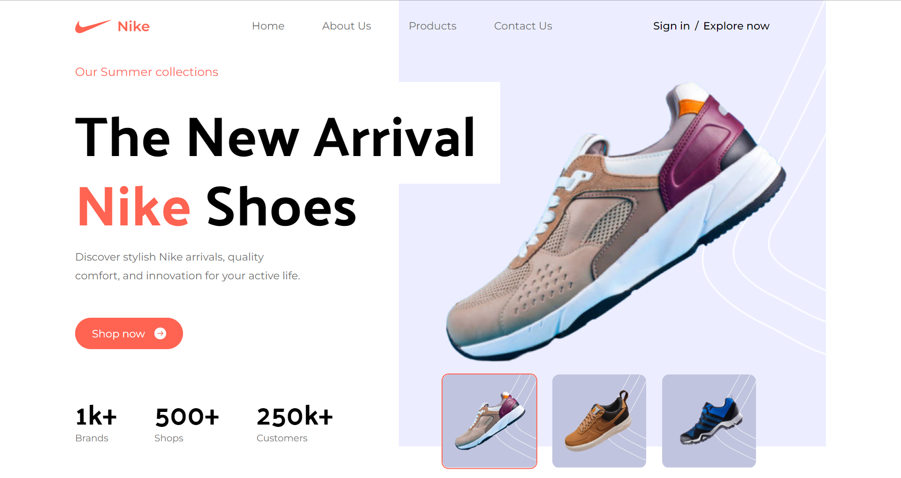
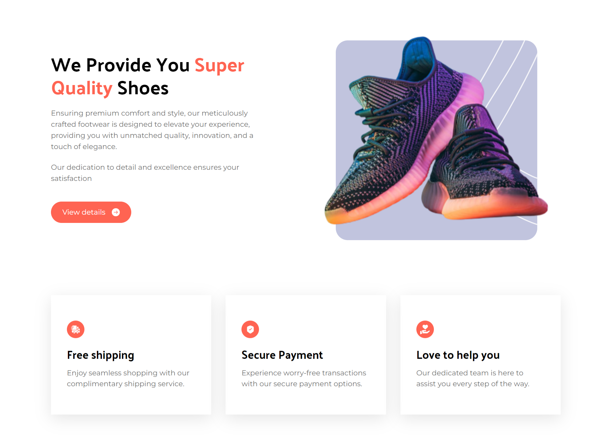
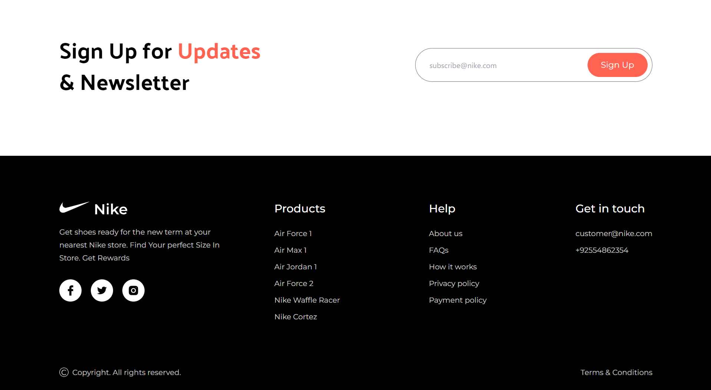

<p align="center">
  
  
  
  
  
  
</p>


## 📋 <a name="table">Table of Contents</a>

1. 🤖 [Introduction](#introduction)
2. ⚙️ [Tech Stack](#tech-stack)
3. 🔋 [Features](#features)
4. 🤸 [Quick Start](#quick-start)


## <a name="introduction">🤖 Introduction</a>

The Nike Landing Page project is a responsive application built with React.js and Tailwind CSS. It includes an engaging hero section, popular products, special offers, and customer reviews to enhance user engagement and provide a seamless browsing experience.

## <a name="tech-stack">⚙️ Tech Stack</a>

- Tailwind CSS
- React.js

## <a name="features">🔋 Features</a>


👉 **Complex Hero Section**: Appealing hero section showcasing key elements

👉 **Super Quality Products Section**: A section highlighting high quality products

👉 **Popular Products Section**: A section highlighting popular Nike products

👉 **Special Offers**: Showcase special offers 

👉 **Customer Reviews Section**: A Reviews section for a captivating user experience

👉 **Newsletter Integration**: A newsletter for user engagement

👉 **Footer**: A comprehensive footer section containing various links

👉 **Mobile Responsive**: The entire website is responsive across various devices, emphasizing Tailwind's mobile-friendly capabilities.


## <a name="quick-start">🤸 Quick Start</a>

Follow these steps to set up the project locally on your machine.

**Prerequisites**

Make sure you have the following installed on your machine:

- [Git](https://git-scm.com/)
- [Node.js](https://nodejs.org/en)
- [npm](https://www.npmjs.com/) (Node Package Manager)

**Cloning the Repository**

```bash
git clone https://github.com/vidmal001/Nike-Landing-Page.git
cd Nike_Landing_Page
```

**Installation**

Install the project dependencies using npm:

```bash
npm install
```


**Running the Project**

```bash
npm start
```

Open [http://localhost:5173](http://localhost:5173) in your browser to view the project.
